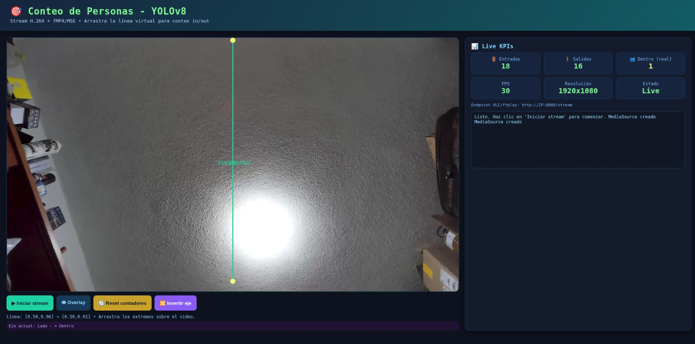

# LicheeRV-Nano-YOLOV8N

<p align="center">
  
</p>

An embedded real-time object detection and tracking system running on [LicheeRV Nano](https://wiki.sipeed.com/hardware/en/lichee/RV_Nano/1_intro.html), leveraging the SG2002 NPU for YOLOv8 inference and delivering live video streams via HTTP/MSE.

**Based on:**
- [Cvitek TDL SDK](https://github.com/milkv-duo/cvitek-tdl-sdk-sg200x)
- [SPCOM Build System](https://github.com/scpcom/LicheeRV-Nano-Build)

---

## Table of Contents

- [Features](#features)
- [Architecture](#architecture)
- [Quick Start](#quick-start)
- [System Overview](#system-overview)
  - [1. Hardware Input (Sensor)](#1-hardware-input-sensor)
  - [2. Memory Management (VB Pools)](#2-memory-management-vb-pools)
  - [3. Video Processing (VPSS)](#3-video-processing-vpss)
  - [4. AI Inference & Tracking](#4-ai-inference--tracking)
  - [5. HTTP Streaming Server](#5-http-streaming-server)
- [Technical Reference](#technical-reference)
- [Code Examples](#code-examples)
- [Performance Metrics](#performance-metrics)
- [Configuration](#configuration)
- [Troubleshooting](#troubleshooting)
- [Build from Source](#build-from-source)

---

## Features

- **Real-time Object Detection:** YOLOv8n model running on dedicated NPU at 25+ FPS
- **Person Tracking:** Persistent ID assignment with IoU + centroid distance matching
- **People Counting:** Bidirectional counting using virtual crossing lines
- **Low-latency Streaming:** H.264 encoding with HTTP/MSE support (~120ms glass-to-glass)
- **Web Interface:** Built-in web UI with live statistics and analytics
- **Multi-threaded Pipeline:** Parallel inference and encoding threads for optimal performance
- **Hardware Acceleration:** VI/ISP, VPSS scaling, H.264 VENC, NPU inference - all in hardware

---

## Architecture

### System Block Diagram

<p align="center">
  
</p>

The system implements a dual-channel video pipeline:
- **Channel 0 (VPSS_CHN0):** 1920x1080 → VENC (H.264 encoding)
- **Channel 1 (VPSS_CHN1):** 640x480 → TDL/NPU (YOLOv8 inference)

### Sequence Diagram

<p align="center">
  
</p>

**Pipeline Flow:**
```
[GC4653 Sensor] → [VI/ISP] → [VPSS Grp0] ─┬→ [CHN0 1920x1080] → [VENC Thread] → [Ring Buffer] → [HTTP Server]
                                           └→ [CHN1 640x480]  → [TDL Thread]  → [YOLOv8 NPU] → [Tracking]
                                                                                                    ↓
                                                                                            [Metadata Mutex]
                                                                                                    ↑
                                                                                          [VENC Thread reads]
```

---

## Quick Start

### Prerequisites

- LicheeRV Nano board with SG2002 SoC
- GC4653 camera sensor (or compatible)
- MicroSD card (8GB+) with Linux image flashed
- YOLOv8n model converted to `.cvimodel` format

### 1. Build the Application

```bash
# Navigate to the build system root
cd LicheeRV-Nano-Build

# Source the build environment
source build/cvisetup.sh

# Configure for LicheeRV Nano
defconfig sg2002_licheervnano_sd

# Navigate to the sample directory
cd middleware/v2/sample/http_streamet_tdl/

# Build
make clean && make
```

### 2. Deploy to Device

```bash
# Copy binary to device (via SCP or USB)
scp http_streamer_tdl root@192.168.42.1:/mnt/data/

# Copy YOLOv8 model
scp yolov8n_cv181x_int8_sym.cvimodel root@192.168.42.1:/mnt/data/
```

### 3. Run on LicheeRV Nano

```bash
# SSH into device
ssh root@192.168.42.1

# Navigate to data directory
cd /mnt/data

# Run the application
./http_streamer_tdl yolov8n_cv181x_int8_sym.cvimodel
```

### 4. Access Web Interface

Open your browser and navigate to:
```
http://192.168.42.1:8080/
```

**Available endpoints:**
- `/` - Web interface with live video and statistics
- `/stream` - Raw H.264 stream (for VLC/FFplay)
- `/mse_stream` - fMP4 stream for web browsers (MSE)
- `/stats` - JSON endpoint with detection/tracking metrics

---

## System Overview

### Objective

Develop an AI-powered object tracker using the SG2002's dedicated NPU to identify and track people in real-time, streaming annotated video directly to web browsers via HTTP/MSE.

### COCO Dataset

The YOLOv8 model is trained on the [COCO dataset](https://cocodataset.org/#home), enabling detection of:
- **80 object categories** (person, car, dog, etc.)
- **330K images** (>200K labeled)
- **1.5 million object instances**
- **250,000 people with keypoints**

In this application, we filter specifically for **PERSON** class detections.

---

### 1. Hardware Input (Sensor)

**Entry Point:** GC4653 camera sensor

The system dynamically reads sensor configuration from `sensor_cfg.ini` to determine the native resolution capabilities. Raw Bayer data travels through the MIPI/CSI interface to the **VI (Video Input)** module, where the **ISP (Image Signal Processor)** performs:
- Demosaicing
- Color correction
- Noise reduction
- Auto-exposure/white balance

The VI module is then **bound** to VPSS via software, creating a zero-copy DMA pipeline.

---

### 2. Memory Management (VB Pools)

Before processing begins, we allocate **4 dedicated DMA buffer pools** to manage video memory efficiently:

| Pool ID | Purpose | Resolution | Format | Block Count | Use Case |
|---------|---------|-----------|--------|-------------|----------|
| `VB_POOL_VI` | Sensor input | 2592x1944 | NV21 | 3 | Raw VI capture |
| `VB_POOL_VENC` | Encoder output | 1920x1080 | NV21 | 4 | High-quality encoding |
| `VB_POOL_TDL` | AI input | 640x480 | NV21 | 3 | NPU inference |
| `VB_POOL_PREPROC` | Color conversion | 768x1024 | RGB888P | 1 | NV21→RGB for NPU |

**Why separate pools?**
Prevents memory fragmentation and ensures predictable buffer availability for each pipeline stage.

#### 2.1 TDL Runtime Initialization

After VB pools are ready, we initialize the **TDL (Task Description Language) SDK**:

1. **Load YOLOv8 Model:** The `.cvimodel` file is loaded into NPU memory
2. **Allocate Internal Buffers:** Weights, intermediate tensors, output layers
3. **Enable Preprocessing:** Automatic NV21→RGB planar conversion
4. **Validate Dimensions:** Ensure model input (640x480) matches VPSS CHN1 output

This ensures all inference runs **entirely on the NPU**, avoiding CPU overhead.

---

### 3. Video Processing (VPSS)

The **VPSS (Video Process Sub-System)** is the hardware scaler/router. We configure **Group 0** to generate two simultaneous outputs:

**Channel 0 (VENC):**
- Resolution: 1920x1080 NV21
- Purpose: High-quality output for human viewing
- Consumer: VENC thread (H.264 encoding)

**Channel 1 (TDL):**
- Resolution: 640x480 NV21
- Purpose: Optimized for NPU inference
- Consumer: TDL thread (YOLOv8 inference)

Both channels run in parallel, fed from the same VI input via hardware DMA.

---

### 4. AI Inference & Tracking

The application uses **two asynchronous threads** to maximize throughput:

#### Thread 1: TDL (AI Inference)

```c
// Pseudo-code of TDL thread
while (!exit) {
    // Get frame from VPSS Channel 1 (640x480)
    CVI_VPSS_GetChnFrame(VPSS_GRP, VPSS_CHN_TDL, &frame, 1000);

    // Run YOLOv8 inference on NPU
    CVI_TDL_Detection(tdl_handle, &frame, &detections);

    // Filter only PERSON class
    filter_persons(&detections);

    // Update tracking with IoU + centroid matching
    pthread_mutex_lock(&g_track_lock);
    update_person_tracks(&detections, timestamp);
    pthread_mutex_unlock(&g_track_lock);

    // Release frame
    CVI_VPSS_ReleaseChnFrame(VPSS_GRP, VPSS_CHN_TDL, &frame);
}
```

#### Thread 2: VENC (Encoding & Drawing)

```c
// Pseudo-code of VENC thread
while (!exit) {
    // Get high-res frame from VPSS Channel 0 (1920x1080)
    CVI_VPSS_GetChnFrame(VPSS_GRP, VPSS_CHN_VENC, &frame, 1000);

    // Read latest tracking metadata (thread-safe)
    pthread_mutex_lock(&g_track_lock);
    memcpy(&local_tracks, &g_tracks, sizeof(g_tracks));
    pthread_mutex_unlock(&g_track_lock);

    // Draw bounding boxes + IDs on NV21 frame
    for (int i = 0; i < track_count; i++) {
        draw_box(&frame, local_tracks[i].bbox);
        draw_text(&frame, local_tracks[i].id);
    }

    // Encode to H.264
    CVI_VENC_SendFrame(VENC_CHN, &frame, 1000);
    CVI_VENC_GetStream(VENC_CHN, &stream, 1000);

    // Store in ring buffer
    pthread_mutex_lock(&g_frame_lock);
    store_in_ring_buffer(&stream);
    pthread_mutex_unlock(&g_frame_lock);

    CVI_VENC_ReleaseStream(VENC_CHN, &stream);
    CVI_VPSS_ReleaseChnFrame(VPSS_GRP, VPSS_CHN_VENC, &frame);
}
```

#### 4.1 Person Detection (YOLOv8 on NPU)

Each frame from VPSS CHN1 (640×480) is fed to the YOLOv8 model running on the NPU. The model outputs:
- **Bounding Box:** (x, y, width, height)
- **Confidence Score:** 0.0 - 1.0
- **Class ID:** Filtered for `CVI_TDL_DET_TYPE_PERSON`
- **Timestamp:** For tracking correlation

Bounding boxes are rescaled to match the 1920×1080 output frame.

#### 4.2 Tracking Logic (ID Assignment)

Since YOLOv8 doesn't provide persistent IDs, we implement tracking via:

1. **IoU (Intersection over Union):** Measures bbox overlap between frames
2. **Centroid Distance:** Euclidean distance between bbox centers
3. **Matching Algorithm:**
   - For each new detection, compare with all existing tracks
   - If IoU > 0.3 **AND** distance < threshold → **same track ID**
   - If no match → **create new unique ID**
4. **Track Maintenance:**
   - Tracks with no match for 15 frames → **removed**
   - Tracks with 3+ consecutive hits → **confirmed and displayed**

This produces stable tracking even with occlusions or multiple people.

#### 4.3 People Counting (Bidirectional)

Counting is based on **virtual line crossing**:

```c
// Line configuration (normalized coordinates)
line_state_t g_line = {
    .x1 = 0.2f, .y1 = 0.2f,  // Start point
    .x2 = 0.8f, .y2 = 0.2f,  // End point
    .count_in = 0,
    .count_out = 0,
    .inside_sign = 1  // 1 = below line is "inside"
};

// Detect crossing
int sign_now = (person.cy > line.y) ? 1 : -1;
if (track->last_sign != 0 && sign_now != track->last_sign) {
    if (sign_now == g_line.inside_sign) {
        g_line.count_in++;   // Entering
    } else {
        g_line.count_out++;  // Exiting
    }
}
track->last_sign = sign_now;
```

Line configuration is persisted to `/mnt/data/line_cfg.json` and adjustable via web UI.

#### 4.4 Metadata Sharing (Thread-Safe)

The tracking module maintains a **shared metadata structure** protected by mutexes:

```c
typedef struct {
    int id;
    float x1, y1, x2, y2;  // Bounding box
    float cx, cy;          // Centroid
    int class_id;
    int hits;              // Confidence accumulator
    int miss;              // Frames without detection
    uint64_t last_seen_us; // Timestamp
    int last_sign;         // Line crossing state
} track_t;

static track_t g_tracks[MAX_TRACKS];
static pthread_mutex_t g_track_lock = PTHREAD_MUTEX_INITIALIZER;
```

This metadata is consumed by:
- **VENC thread** → Draw boxes/labels on video
- **HTTP server** → Serve JSON stats at `/stats` endpoint

---

### 5. HTTP Streaming Server

A **CivetWeb** HTTP server runs on **port 8080** with the following endpoints:

| Endpoint | Method | Content-Type | Description |
|----------|--------|--------------|-------------|
| `/` | GET | text/html | Web interface with video player + stats |
| `/stream` | GET | video/h264 | Raw H.264 stream (for VLC/FFplay) |
| `/mse_stream` | GET | video/mp4 | fMP4 chunks for MSE (web browsers) |
| `/stats` | GET | application/json | Live tracking statistics |

#### How MSE Streaming Works

1. **Initialization:** Browser sends GET to `/mse_stream`
2. **fMP4 Header:** Server sends `ftyp + moov` boxes with SPS/PPS
3. **Media Segments:** Server streams `moof + mdat` boxes containing H.264 NALUs
4. **Client-side:** JavaScript MSE API appends segments to `SourceBuffer`

**Advantages over raw H.264:**
- No browser plugins required
- Low latency (~120ms)
- Seekable timeline
- Compatible with all modern browsers

---

## Technical Reference

### Video Pipeline Configuration

| Component | Parameter | Value | Notes |
|-----------|-----------|-------|-------|
| **Sensor** | Model | GC4653 | 5MP CMOS |
| | Native Resolution | 2592x1944 | From sensor_cfg.ini |
| | Interface | MIPI CSI-2 | 2-lane |
| **VI** | Output Format | NV21 | YUV420 semi-planar |
| | Frame Rate | 30 FPS | Configurable |
| **VPSS** | Group | 0 | Dual-channel mode |
| | CHN0 Resolution | 1920x1080 | Encoding output |
| | CHN1 Resolution | 640x480 | AI input |
| **VENC** | Codec | H.264 | Hardware accelerated |
| | Profile | Main | Baseline also supported |
| | Bitrate | ~2 Mbps | VBR mode |
| | GOP Size | 30 | 1 second |
| **TDL** | Model | YOLOv8n | INT8 quantized |
| | Input Size | 640x480 | RGB planar |
| | Inference Time | ~40ms | On NPU |

### Memory Layout

```
DRAM (256MB total on SG2002)
┌────────────────────────────┐
│  VB_POOL_VI                │  2592x1944 NV21 × 3 = ~36 MB
├────────────────────────────┤
│  VB_POOL_VENC              │  1920x1080 NV21 × 4 = ~12 MB
├────────────────────────────┤
│  VB_POOL_TDL               │  640x480 NV21 × 3 = ~1.4 MB
├────────────────────────────┤
│  VB_POOL_PREPROC           │  768x1024 RGB × 1 = ~2.4 MB
├────────────────────────────┤
│  NPU Internal Memory       │  ~15 MB (model weights + tensors)
├────────────────────────────┤
│  Application Heap          │  ~10 MB (ring buffer, tracking data)
├────────────────────────────┤
│  Linux Kernel + Drivers    │  ~60 MB
├────────────────────────────┤
│  Available / Cached        │  ~120 MB
└────────────────────────────┘
```

---

## Code Examples

### Example 1: Tracking Data Structure

```c
// Maximum concurrent tracks
#define MAX_TRACKS 64

// Persistent track information
typedef struct {
    int id;                  // Unique track ID
    float x1, y1, x2, y2;   // Bounding box coordinates
    float cx, cy;           // Centroid position
    int class_id;           // Object class (CVI_TDL_DET_TYPE_PERSON)
    int hits;               // Consecutive detection count
    int miss;               // Consecutive miss count
    uint64_t last_seen_us;  // Last detection timestamp (microseconds)
    int last_sign;          // Line crossing state (-1, 0, +1)
} track_t;

// Global tracking state
static track_t g_tracks[MAX_TRACKS];
static int g_track_count = 0;
static int g_next_track_id = 1;
static pthread_mutex_t g_track_lock = PTHREAD_MUTEX_INITIALIZER;
```

### Example 2: VB Pool Configuration

```c
// Initialize Video Buffer Pools
VB_CONFIG_S stVbConfig;
memset(&stVbConfig, 0, sizeof(VB_CONFIG_S));

// Pool 0: VI - Native sensor resolution
stVbConfig.astCommPool[VB_POOL_VI].u32BlkSize =
    COMMON_GetPicBufferSize(sensor_w, sensor_h,
                           PIXEL_FORMAT_NV21,
                           DATA_BITWIDTH_8,
                           COMPRESS_MODE_NONE,
                           DEFAULT_ALIGN);
stVbConfig.astCommPool[VB_POOL_VI].u32BlkCnt = 3;

// Pool 1: VENC - 1080p output
stVbConfig.astCommPool[VB_POOL_VENC].u32BlkSize =
    COMMON_GetPicBufferSize(1920, 1080, PIXEL_FORMAT_NV21,
                           DATA_BITWIDTH_8, COMPRESS_MODE_NONE,
                           DEFAULT_ALIGN);
stVbConfig.astCommPool[VB_POOL_VENC].u32BlkCnt = 4;

// Initialize VB system
CVI_VB_SetConfig(&stVbConfig);
CVI_VB_Init();
```

### Example 3: Line Crossing Detection

```c
// Virtual line configuration (normalized [0..1])
typedef struct {
    float x1, y1, x2, y2;  // Line endpoints
    int count_in;          // People entering
    int count_out;         // People exiting
    int inside_sign;       // Which side is "inside" (+1 or -1)
} line_state_t;

// Detect crossing
void check_line_crossing(track_t *track, float cy) {
    float line_y = g_line.y1;  // Horizontal line example

    int sign_now = (cy > line_y) ? 1 : -1;

    // State transition detection
    if (track->last_sign != 0 && sign_now != track->last_sign) {
        pthread_mutex_lock(&g_line_lock);
        if (sign_now == g_line.inside_sign) {
            g_line.count_in++;   // Crossing into "inside" zone
        } else {
            g_line.count_out++;  // Crossing out
        }
        pthread_mutex_unlock(&g_line_lock);
    }

    track->last_sign = sign_now;
}
```

### Example 4: Drawing Bounding Boxes on NV21

```c
// Draw rectangle on NV21 frame (Y channel only)
void draw_box_nv21(VIDEO_FRAME_INFO_S *frame,
                   int x, int y, int w, int h,
                   uint8_t luma_value) {
    uint8_t *y_plane = (uint8_t*)frame->stVFrame.u64PhyAddr[0];
    int stride = frame->stVFrame.u32Stride[0];

    // Top and bottom edges
    for (int i = 0; i < w; i++) {
        y_plane[y * stride + x + i] = luma_value;           // Top
        y_plane[(y+h) * stride + x + i] = luma_value;       // Bottom
    }

    // Left and right edges
    for (int j = 0; j < h; j++) {
        y_plane[(y+j) * stride + x] = luma_value;           // Left
        y_plane[(y+j) * stride + x + w] = luma_value;       // Right
    }
}
```

---

## Performance Metrics

### Measured Performance (YOLOv8n @ 640x480, INT8 quantization)

| Metric | Value | Notes |
|--------|-------|-------|
| **Glass-to-Glass Latency** | ~120ms | Sensor → Browser display |
| **NPU Inference Time** | 38-42ms | Per frame, on NPU |
| **VENC Encoding Time** | 10-15ms | H.264 @ 1080p |
| **Encoder Frame Rate** | 30 FPS | Locked to sensor rate |
| **Inference Frame Rate** | 25-28 FPS | Limited by NPU processing |
| **CPU Usage** | 15-20% | Both threads combined |
| **NPU Utilization** | 60-80% | During continuous inference |
| **Total RAM Usage** | ~80 MB | VB pools + application heap |
| **HTTP Bitrate** | 1.8-2.5 Mbps | Variable bitrate (VBR) |

### Latency Breakdown

```
Total: ~120ms glass-to-glass

Sensor capture:        ~16ms  (1 frame @ 60Hz)
VI/ISP processing:     ~8ms
VPSS scaling:          ~5ms
TDL inference:         ~40ms  (NPU)
VENC encoding:         ~12ms  (hardware)
Network transmission:  ~20ms  (local LAN)
Browser decode/render: ~19ms  (MSE + GPU)
```

### Optimization Tips

To reduce latency further:
1. **Increase sensor FPS:** 60 FPS mode (halves capture latency)
2. **Reduce encoder GOP:** GOP=15 (faster keyframe access)
3. **Lower bitrate:** VBR with lower target (reduces network delay)
4. **Use wired connection:** Eliminates WiFi jitter

---

## Configuration

### Adjustable Parameters in Code

Edit `http_streamer_tdl.c` before building:

```c
// === Encoding Resolution ===
#define VENC_WIDTH      1920   // Change to 1280 for lower bitrate
#define VENC_HEIGHT     1080   // Change to 720

// === Frame Rates ===
#define VENC_FPS        30     // Encoder target FPS

// === AI Input Resolution ===
#define TDL_INPUT_WIDTH   640  // Smaller = faster inference
#define TDL_INPUT_HEIGHT  480  // Must match model input size

// === Detection Threshold ===
// In main() function:
CVI_TDL_SetModelThreshold(tdl_handle, CVI_TDL_SUPPORTED_MODEL_YOLOV8_DETECTION, 0.5);
// Lower = more detections (more false positives)
// Higher = fewer detections (miss some objects)

// === Tracking Parameters ===
#define MAX_TRACK_MISS  15     // Frames before removing inactive track
#define MIN_TRACK_HITS  3      // Hits required to confirm track

// === Ring Buffer Size ===
#define BUFFER_SIZE     60     // Number of frames buffered (2 seconds @ 30fps)
```

### Runtime Configuration (via Web UI)

- **Virtual line position:** Drag endpoints in web interface
- **Line crossing direction:** Toggle "inside" zone orientation
- **Counter reset:** Button to reset count_in/count_out

### Sensor Configuration

Edit `/mnt/data/sensor_cfg.ini` on device:

```ini
[sensor]
type = gc4653
width = 2592
height = 1944
framerate = 30
```

Supported sensors: GC4653, IMX327, SC2336, SC4336 (check TDL SDK docs)

---

## Troubleshooting

### Problem: Application crashes with "CVI_VB_Init failed: 0xa0038004"

**Cause:** Insufficient memory for VB pools

**Solution:**
1. Check DRAM size: `cat /proc/meminfo | grep MemTotal`
2. Reduce VB pool block counts in `init_vb_pool()`:
   ```c
   stVbConfig.astCommPool[VB_POOL_VI].u32BlkCnt = 2;    // Was 3
   stVbConfig.astCommPool[VB_POOL_VENC].u32BlkCnt = 3;  // Was 4
   ```
3. Reduce sensor resolution in `sensor_cfg.ini`

---

### Problem: Stream freezes after 30-60 seconds

**Cause:** Ring buffer overflow (client too slow)

**Solution:**
1. Check network bandwidth: `iperf3 -s` on device, test from client
2. Reduce encoder bitrate:
   ```c
   stVencChnAttr.stRcAttr.stH264Vbr.u32MaxBitrate = 1500;  // Was 2500
   ```
3. Increase buffer size: `#define BUFFER_SIZE 120`
4. Use wired Ethernet instead of WiFi

---

### Problem: No detections appear / All detections filtered out

**Cause:** Model threshold too high or wrong model class

**Solution:**
1. Lower detection threshold:
   ```c
   CVI_TDL_SetModelThreshold(tdl_handle, model_id, 0.3);  // Was 0.5
   ```
2. Verify model supports PERSON class:
   ```bash
   # Check model metadata
   cvi_model_info yolov8n_cv181x_int8_sym.cvimodel
   ```
3. Disable person-only filter temporarily (comment out `filter_persons()` call)

---

### Problem: CivetWeb fails to start "Address already in use"

**Cause:** Port 8080 already occupied

**Solution:**
1. Check existing processes:
   ```bash
   netstat -tulpn | grep 8080
   kill <PID>
   ```
2. Change server port in code:
   ```c
   const char *options[] = {"listening_ports", "8081", NULL};
   ```

---

### Problem: Model file not found or fails to load

**Cause:** Incorrect path or incompatible model format

**Solution:**
1. Verify file exists:
   ```bash
   ls -lh /mnt/data/*.cvimodel
   ```
2. Check model compatibility:
   - Must be INT8 quantized for NPU
   - Must match chip architecture (CV181X vs CV180X)
   - Input dimensions must match `TDL_INPUT_WIDTH x TDL_INPUT_HEIGHT`
3. Re-convert model using TPU-MLIR toolkit

---

### Problem: High CPU usage (>50%)

**Cause:** Software fallback instead of hardware acceleration

**Solution:**
1. Verify NPU is active:
   ```bash
   cat /proc/cvitek/cvi_sys | grep tpu
   ```
2. Check VB pool attachment:
   - Ensure `CVI_VPSS_AttachVbPool()` succeeds for both channels
3. Disable unnecessary frame copying:
   - Use `CVI_VPSS_GetChnFrame()` without memcpy when possible

---

### Problem: Tracking IDs jump/flicker rapidly

**Cause:** Low IoU threshold or insufficient track confirmation

**Solution:**
1. Increase `MIN_TRACK_HITS`:
   ```c
   #define MIN_TRACK_HITS  5  // Was 3
   ```
2. Adjust IoU threshold in `update_person_tracks()`:
   ```c
   if (iou > 0.4 && distance < 100) {  // Was 0.3
   ```
3. Decrease `MAX_TRACK_MISS` to remove stale tracks faster

---

### Problem: Build fails with "libcivetweb.so: cannot find"

**Cause:** CivetWeb not built in buildroot

**Solution:**
1. Add CivetWeb to buildroot config:
   ```bash
   cd buildroot
   make menuconfig
   # Target packages → Networking → civetweb → Enable
   make
   ```
2. Or statically link:
   ```make
   LDFLAGS += /path/to/libcivetweb.a
   ```

---

## Build from Source

### Full Build System Setup

```bash
# 1. Clone the complete build repository
git clone https://github.com/scpcom/LicheeRV-Nano-Build --depth=1
cd LicheeRV-Nano-Build

# 2. Clone host tools (cross-compilation toolchains)
git clone https://github.com/sophgo/host-tools --depth=1

# 3. Clone TDL SDK (AI framework)
git clone https://github.com/milkv-duo/cvitek-tdl-sdk-sg200x --depth=1
cd cvitek-tdl-sdk-sg200x
./prepare_tpu.sh  # Downloads TPU runtime libraries
cd ..

# 4. Source build environment
source build/cvisetup.sh

# 5. Configure for LicheeRV Nano (C906 RISC-V core)
defconfig sg2002_licheervnano_sd

# 6. Build entire system (first time may take 1-2 hours)
build_all
# Note: If Qt5 fails, just run build_all again

# 7. Flash SD card
sudo dd if=install/soc_sg2002_licheervnano_sd/boot-sd.img of=/dev/sdX bs=4M status=progress
sync
```

### Build Only the Application

```bash
# Navigate to sample directory
cd middleware/v2/sample/http_streamet_tdl/

# Check dependencies
make check-deps

# Build
make clean && make

# Output binary: ./http_streamer_tdl
```

### Cross-Compilation Variables

The Makefile auto-detects toolchain from environment. Manual override:

```bash
# For RISC-V 64 with musl libc (default)
make SDK_VER=musl_riscv64 CHIP=CV181X

# For RISC-V 64 with glibc
make SDK_VER=glibc_riscv64 CHIP=CV181X

# For ARM64 (if using Lichee A53 Nano)
make SDK_VER=64bit CHIP=CV181X
```

### Install to Custom Rootfs

```bash
# Build and install to buildroot output
make install DESTDIR=$(TOP_DIR)/buildroot/output/target

# Or install to existing rootfs directory
make install DESTDIR=/path/to/rootfs
```

### Debug Build

```bash
# Build with debug symbols and no optimization
make debug

# Run with GDB on device
gdbserver :2345 ./http_streamer_tdl model.cvimodel

# Connect from host
riscv64-unknown-linux-musl-gdb http_streamer_tdl
(gdb) target remote 192.168.42.1:2345
```

---

## Project Structure

```
LicheeRV-Nano-YOLOV8N/
├── README.md                          # This file
├── images/
│   ├── Diagrama de Arquitectura (Bloques).jpeg
│   ├── Diagrama de Secuencia (El flujo de vida).jpeg
│   └── interface.jpg
└── (source files in middleware/v2/sample/http_streamet_tdl/)
    ├── http_streamer_tdl.c           # Main application (2800+ lines)
    ├── Makefile                       # Build configuration
    └── (generated after build)
        └── http_streamer_tdl         # Compiled binary
```

---

## License

This project integrates components from multiple sources:

- **Cvitek TDL SDK:** Sophgo proprietary license (check repository)
- **LicheeRV-Nano-Build:** GPL v2 (kernel/buildroot components)
- **CivetWeb:** MIT License
- **YOLOv8 Model:** AGPL-3.0 (Ultralytics)

Please review individual component licenses before commercial use.

---

## Contributing

Contributions are welcome! Areas for improvement:

- [ ] Support for additional YOLOv8 classes (not just PERSON)
- [ ] RTSP server support (in addition to HTTP)
- [ ] GPU-accelerated drawing (currently CPU-based)
- [ ] Advanced tracking algorithms (DeepSORT, ByteTrack)
- [ ] Multi-camera support
- [ ] Recording to file with metadata overlay

---

## References

- [LicheeRV Nano Documentation](https://wiki.sipeed.com/hardware/en/lichee/RV_Nano/1_intro.html)
- [Cvitek TDL SDK Guide](https://github.com/milkv-duo/cvitek-tdl-sdk-sg200x)
- [SG2002 Datasheet](https://github.com/sophgo/sophgo-doc)
- [YOLOv8 Model Conversion](https://milkv.io/docs/duo/application-development/tdl-sdk/tdl-sdk-yolov8)
- [Media Source Extensions (MSE) API](https://developer.mozilla.org/en-US/docs/Web/API/Media_Source_Extensions_API)

---

**Developed by:** [Your Name/Team]
**Last Updated:** December 11, 2025
